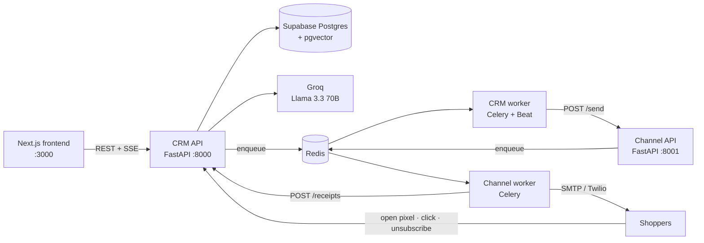
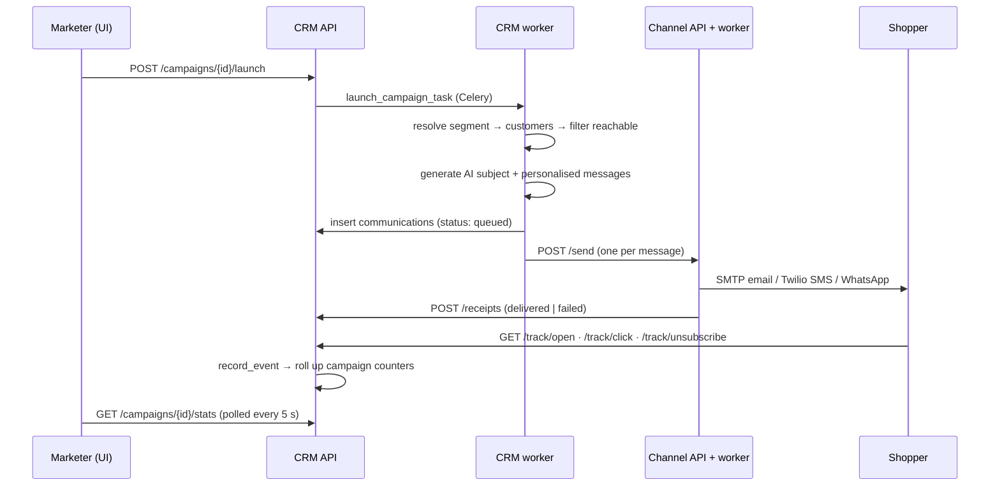

# 🚀 Orbit — AI-Native CRM for Modern Brands

> Transform customer data into intelligent actions with AI-powered customer insights, segmentation, engagement, and automation.

**Orbit** is an AI-native mini CRM for D2C and retail brands. It scores every shopper on Recency, Frequency and Monetary value, turns plain-English descriptions into audience segments, writes personalised messages with an LLM, sends them through real email / SMS / WhatsApp gateways, and tracks delivery, opens and clicks end to end.

---

## 📑 Table of Contents

1. [Features](#-features)
2. [Architecture](#️-architecture)
3. [Tech Stack](#️-tech-stack)
4. [Project Structure](#-project-structure)
5. [Modules in Detail](#-modules-in-detail)
   - [CRM Service](#1-crm-service-backendcrm)
   - [Channel Service](#2-channel-service-backendchannel)
   - [Frontend](#3-frontend-frontend)
   - [Database](#4-database-backendcrmdb)
   - [Scripts & Tooling](#5-scripts--tooling)
6. [How to Run](#-how-to-run)
7. [Testing & CI](#-testing--ci)
8. [Troubleshooting](#-troubleshooting)
9. [Security Notes](#-security-notes)
10. [Roadmap](#️-roadmap)

---

## ✨ Features

| Feature | What it does |
|---|---|
| **NL → Segment** | "High spenders who went quiet for 60 days" becomes a validated filter spec with a live audience count and preview. |
| **Smart Search (RAG)** | Vector search over AI-embedded customer profiles, lookalike discovery, and one-click "save as segment". |
| **AI Copilot** | A tool-calling agent that finds audiences, drafts copy, creates campaigns and launches them after your confirmation, streamed live. |
| **Marketing Strategist** | Proactive opportunity analysis, a win-back revenue forecast, and a weekly narrative report. |
| **RFM scoring & churn risk** | Every customer scored 0–100 with a churn tier, refreshed on each order/import and nightly. |
| **Personalised campaigns** | Unique LLM-written copy per customer; branded HTML email with open tracking, click tracking and one-click unsubscribe. |
| **Real delivery** | A separate gateway sends via SMTP and Twilio and reports truthful delivered/failed receipts. |
| **AI data import** | Upload CSV / JSON / Excel with any column names; the agent maps headers and normalises phones, dates, currency and channels. |
| **Human-in-the-loop learning** | Campaign ratings and comments shape future AI-generated copy for that brand. |
| **Analytics & PDF reports** | KPI dashboard, data-explorer charts, and downloadable executive PDF reports with AI analysis. |
| **Multi-tenant** | Many brands on one deployment; every record is scoped to an organization. |

---

## 🏗️ Architecture



Five processes plus Redis:

| Process | Port | Role |
|---|---|---|
| CRM API | 8000 | All business data, AI features, analytics, tracking endpoints |
| CRM worker (+ Beat) | — | Campaign launches, RFM scoring, nightly re-scoring at 02:00 UTC |
| Channel API | 8001 | Accepts messages to send (`202 Accepted`) |
| Channel worker | — | Delivers messages via SMTP / Twilio, reports receipts back to the CRM |
| Frontend | 3000 | Next.js web app |
| Redis | 6379 | Celery broker/result backend and AI-summary cache |

### Lifecycle of a campaign



---

## 🛠️ Tech Stack

| Layer | Technology |
|---|---|
| Frontend | Next.js 14 (App Router), React 18, TypeScript, Tailwind CSS, Recharts, lucide-react, sonner |
| Backend | Python 3.11, FastAPI, Pydantic v2, Celery 5, Redis |
| Data | Supabase (PostgreSQL 15 + pgvector) |
| AI | Groq API (Llama 3.3 70B) for generation and tool calling; fastembed (`BAAI/bge-small-en-v1.5`) for local embeddings |
| Data processing | pandas, NumPy, openpyxl |
| Messaging | SMTP (Brevo, Gmail, Resend, SendGrid, …), Twilio SMS / WhatsApp |
| Reports | ReportLab |
| Tooling | Docker Compose, pytest, ruff, ESLint, GitHub Actions |

---

## 📁 Project Structure

```text
AI-CRM/
├── backend/
│   ├── crm/                         # Core API + background workers
│   │   ├── main.py                  # FastAPI app, CORS, router registration
│   │   ├── config.py                # Settings + lazy Supabase/Redis clients
│   │   ├── deps.py                  # Multi-tenant org scoping (OrgContext)
│   │   ├── celery_app.py            # Celery app + nightly beat schedule
│   │   ├── routers/                 # HTTP endpoints (14 routers)
│   │   ├── services/                # Business logic (AI, RFM, segments, RAG, reports, …)
│   │   ├── tasks/                   # Celery tasks (campaign launch, scoring)
│   │   ├── models/                  # Pydantic request/response schemas
│   │   ├── db/
│   │   │   ├── migrations/          # 001–006 SQL, run in order
│   │   │   ├── seed.py              # Demo data generator
│   │   │   ├── backfill_demo_org.py
│   │   │   └── backfill_embeddings.py
│   │   ├── tests/
│   │   ├── Dockerfile
│   │   ├── requirements.txt         # runtime deps
│   │   └── requirements-dev.txt     # + pytest, ruff
│   └── channel/                     # Messaging gateway
│       ├── main.py                  # FastAPI app: /send, /health, /channels/status
│       ├── config.py                # SMTP / Twilio settings
│       ├── senders.py               # Real SMTP + Twilio senders
│       ├── routers/send.py
│       ├── tasks/deliver.py         # Celery delivery task + receipt callback
│       ├── tests/
│       ├── Dockerfile
│       ├── requirements.txt
│       └── requirements-dev.txt
├── frontend/
│   ├── app/                         # One folder per route (see Frontend section)
│   ├── components/                  # AppShell (auth guard), Sidebar
│   ├── lib/                         # api.ts, auth.ts, utils.ts
│   └── package.json
├── docs/
│   ├── DEVELOPMENT.md               # Contributor guide
│   └── ADR.md                       # Architecture decision records
├── scripts/
│   ├── start.ps1 / stop.ps1         # Windows one-command launcher
│   └── smtp_capture.py              # Local fake SMTP server for testing email
├── samples/sample_customers.xlsx    # Example import file
├── .github/workflows/ci.yml         # Lint + tests + build
├── docker-compose.yml               # Backend stack
├── Makefile                         # Shortcuts: up, down, test, lint, seed
└── requirements.txt                 # All backend Python deps in one install
```

---

## 🧩 Modules in Detail

### 1. CRM Service (`backend/crm`)

The core of the system: a FastAPI application backed by Supabase, with Celery workers for long-running jobs. All endpoints are served under `/api/v1`, and interactive API docs are available at **http://localhost:8000/docs**.

#### 1.1 Core files

| File | Responsibility |
|---|---|
| `main.py` | Creates the FastAPI app, configures CORS from `ALLOWED_ORIGINS`, mounts all routers under `/api/v1`, exposes `GET /health` and `GET /api/v1/channels/status` (proxied from the channel service). |
| `config.py` | `Settings` (pydantic-settings) loaded from `.env` in the working directory. Also provides **lazy** `supabase` and `redis_client` proxies that only connect on first use, so imports, tests and linting work without credentials. |
| `deps.py` | `get_org` dependency → `OrgContext`. Reads the `X-Org-Id` header: a UUID scopes the request to that organization; `ALL` or no header is the platform-admin view. `scope(query)` adds the `org_id` filter to reads, `stamp(payload)` sets `org_id` on inserts, `require_org()` rejects admin-wide writes. |
| `celery_app.py` | Celery app on the `crm` queue (Redis broker). Registers `tasks.score_customers` and `tasks.campaigns`, and schedules `batch_score_all_customers` nightly at 02:00 UTC. `CELERY_TASK_ALWAYS_EAGER=true` runs tasks in-process without a broker. |

#### 1.2 Routers (`routers/`)

| Router | Endpoints | Purpose |
|---|---|---|
| `auth.py` | `POST /auth/org/signup` · `POST /auth/org/login` · `POST /auth/admin/login` | Organization signup generates a login ID like `ORB-7F3K2A`; passwords are hashed with PBKDF2-SHA256 (200k iterations). Login returns the org's UUID used as `X-Org-Id`. |
| `customers.py` | `GET /customers` · `GET /customers/{id}` · `POST /customers` · `DELETE /customers` · `DELETE /customers/{id}` | Paginated, searchable, sortable customer list joined with RFM scores; full profile with order history, campaign touchpoints and an AI 360° summary (cached 1 h in Redis). Creating a customer triggers scoring and embedding. |
| `orders.py` | `POST /orders` · `POST /orders/bulk` | Record orders (validated against the org's customers) and re-score the affected customers. |
| `imports.py` | `POST /imports/analyze` · `POST /imports/run` | Two-step AI import: *analyze* asks the LLM to classify the file (customers vs orders) and map headers/values; *run* applies that (optionally edited) mapping, de-duplicates, inserts or updates rows, and schedules scoring. |
| `segments.py` | `GET /segments` · `POST /segments` · `POST /segments/nl2segment` · `POST /segments/{id}/refresh` | Save segments from a filter spec, translate natural language into a filter spec with a count and preview, and refresh cached counts. |
| `semantic.py` | `POST /customers/semantic-search` · `GET /customers/{id}/similar` · `POST /segments/from-semantic` | Vector search by meaning, lookalike customers, and saving a search result as a static segment. |
| `campaigns.py` | `GET /campaigns` · `POST /campaigns` · `POST /campaigns/{id}/launch` · `POST /campaigns/{id}/analyze` · `GET /campaigns/{id}/stats` | Draft campaigns, launch them asynchronously, read delivery/open/click rates, and generate an AI post-mortem from live engagement. |
| `receipts.py` | `POST /receipts` | Callback from the channel service with `delivered` / `failed` (+ failure reason). |
| `tracking.py` | `GET /track/open/{id}.gif` · `GET /track/click/{id}?u=` · `GET /track/unsubscribe/{id}` | Public endpoints hit by recipients: 1×1 open pixel, click redirect, and one-click unsubscribe (`email_opt_out`). |
| `feedback.py` | `POST /feedback` · `GET /campaigns/{id}/feedback` · `GET /org/preferences` | Star rating, business impact and comments per campaign; returns the organization's learned preference profile. |
| `copilot.py` | `POST /copilot/chat` | Streams the Copilot agent as Server-Sent Events: `text`, `tool_call`, `tool_result`, `done`. |
| `strategist.py` | `GET /strategist/analysis` · `GET /strategist/weekly-report` | Strategic opportunities, recommended campaign, forecast, and a narrative weekly report. |
| `analytics.py` | `GET /analytics/overview` · `GET /analytics/campaigns` · `GET /analytics/channels` · `GET /analytics/raw-data` | Dashboard KPIs, per-campaign and per-channel performance, and aggregates for the Data Explorer charts. |
| `reports.py` | `GET /reports/{customer\|campaign\|engagement\|executive}.pdf` | Generates and downloads a PDF report. |

#### 1.3 Services (`services/`)

| Service | What it does |
|---|---|
| `ai_engine.py` | Every LLM interaction via Groq: **NL2Segment** (query → filter spec JSON), **personalisation** (unique messages in batches of 20, adapted to learned brand preferences), **Copilot** agent loop with 7 tools (`get_segments`, `semantic_customer_search`, `create_segment_from_nl`, `draft_message`, `create_campaign`, `launch_campaign`, `get_campaign_stats`), capped at 8 steps and retrying malformed tool calls, **email subject** generation, **import header mapping**, **customer 360° summary**, and **campaign post-mortem**. |
| `segment_executor.py` | Runs a filter spec. Flat AND specs become native PostgREST filters (fast path, with an inner join only when score fields are used); nested AND/OR specs are evaluated in memory over a paginated fetch. Validates fields and operators, returns counts, previews, or the full list of customer IDs for a campaign. Static ID lists from semantic segments are re-checked against the org. |
| `rfm_scorer.py` | pandas RFM computation over completed orders. Each dimension gets a 1–5 quantile score (with safe fallbacks for tiny or skewed datasets); `rfm_score = (R×0.4 + F×0.3 + M×0.3) × 20`. Also derives `top_category` and `last_product`. |
| `import_mapper.py` | Deterministic ingestion after the AI mapping: renames columns, splits full names, normalises phones to E.164 (default country code `+91`), lower-cases emails, maps channel and order-status synonyms (`WA` → `whatsapp`, `refunded` → `returned`), parses dates and currency strings. |
| `embeddings.py` | Loads the fastembed model once (thread-safe, cached in `.model_cache/`) and renders each customer into a natural-language profile ("a high-value, repeat buyer, lapsed, mainly buys skincare…") that is embedded into a 384-d vector. |
| `customer_embedder.py` | Embeds customers and stores vectors in `customers.embedding`; `safe_embed_async` runs in a background thread so CRUD requests never wait or fail on embeddings. |
| `semantic.py` | Embeds the query, calls the `match_customers` / `similar_customers` RPCs, enriches hits with RFM scores and a "why it matched" profile, and exposes `retrieve_context` to ground the Copilot and Strategist (RAG). |
| `strategist.py` | Gathers org signals (churn distribution, at-risk value, average LTV, dormant high-value customers = spend ≥ ₹8,000 and ≥ 60 days inactive, channel performance), forecasts a win-back campaign (reactivation rate = best channel open rate × 0.15, clamped to 5–18%; revenue = reactivations × cohort LTV × 30%), and asks the LLM for opportunities, a recommended campaign, risks and actions. Falls back to a data-only headline if the LLM fails. |
| `report_builder.py` | Builds branded A4 PDFs with ReportLab: KPI table, revenue trend, churn pie, top cities, campaign funnel, channel open rates, revenue by category, an AI business analysis paragraph and Strategist recommendations. |
| `org_learning.py` | Turns campaign feedback into a preference profile (best channel by average rating, discount sensitivity from positive comments, top positive notes) and a prompt snippet injected into message generation. Cached per org and invalidated on new feedback. |
| `delivery_events.py` | The single place that records `delivered` / `opened` / `clicked` / `failed`: de-duplicates per event type, never lets status regress, back-fills an open when a click arrives first, increments campaign counters atomically via RPC, and finalises the campaign when every sent message is resolved. |
| `email_templates.py` | Responsive HTML email with brand header, personalised body, click-tracked CTA button, unsubscribe link and open-tracking pixel (URLs built from `PUBLIC_BASE_URL`). |
| `campaign_sender.py` | Async HTTP client that posts each message to the channel service's `/send`. |

#### 1.4 Background tasks (`tasks/`)

| Task | Trigger | Steps |
|---|---|---|
| `campaigns.launch_campaign_task` | `POST /campaigns/{id}/launch` or the Copilot | Load campaign + segment → resolve customer IDs → load profiles and scores → keep only reachable customers (email present and not opted out; phone for SMS/WhatsApp) → AI subject line (email) → personalised or template messages (`{first_name}`, `{city}`, `{last_product}`, `{top_category}`) → insert `communications` → render tracked HTML → send up to 20 concurrently to the channel service → mark sent/failed and update totals. |
| `campaigns.finalize_campaign` | All messages resolved | Marks the campaign `completed` with `completed_at`. |
| `campaigns.generate_campaign_analysis` | `POST /campaigns/{id}/analyze` | AI post-mortem from current delivery/open/click rates. |
| `score_customers.score_single_customer` | Customer or order created | Re-scores one customer. |
| `score_customers.batch_score_customers` | Imports, bulk orders | Re-scores a list of customers. |
| `score_customers.batch_score_all_customers` | Nightly (Celery Beat) | Re-scores every customer, upserting in chunks of 500. |

#### 1.5 Models (`models/`)

Pydantic schemas for request validation and response shapes: `customer.py` (create with E.164 phone and channel validation, list/detail responses), `order.py` (amount > 0, status enum), `segment.py` (filter spec, NL2Segment request/response), `campaign.py` (create, read, stats), `communication.py` (delivery receipt callback).

**Filter spec format** used by segments:

```json
{
  "operator": "AND",
  "conditions": [
    { "field": "monetary", "op": "gte", "value": 5000 },
    { "operator": "OR", "conditions": [
        { "field": "churn_risk", "op": "in", "value": ["high", "critical"] },
        { "field": "recency_days", "op": "gte", "value": 60 }
    ]}
  ]
}
```

- **Fields:** `monetary`, `recency_days`, `frequency`, `rfm_score`, `churn_risk`, `top_category`, `city`, `channel_pref`
- **Operators:** `eq`, `neq`, `gt`, `gte`, `lt`, `lte`, `in`, `not_in`, `contains`

**Churn tiers** (from `rfm_scorer.py`):

| Tier | Rule (first match wins) |
|---|---|
| `critical` | inactive > 90 days **or** RFM score < 20 |
| `high` | inactive > 60 days **or** RFM score < 40 |
| `medium` | inactive > 30 days **or** RFM score < 60 |
| `low` | everything else |

#### 1.6 Tests (`tests/`)

`fakes.py` provides a chainable fake of the Supabase query builder, so router tests run without a network or credentials. Suites cover customers, orders, segments, campaigns, receipts, RFM scoring and filter-spec evaluation; `test_infra.py` checks real Redis/Supabase connectivity and skips when they are unavailable.

---

### 2. Channel Service (`backend/channel`)

A small, stateless messaging gateway, deliberately separate from the CRM (see [ADR-001](docs/ADR.md)). API docs: **http://localhost:8001/docs**.

| File | Responsibility |
|---|---|
| `main.py` | `GET /health`, `GET /channels/status` (which channels have credentials: email, sms, whatsapp; rcs is not supported), and the `/send` router. |
| `routers/send.py` | `POST /send` validates the message and enqueues delivery, returning `202 Accepted` immediately. |
| `tasks/deliver.py` | Celery task on the `channel` queue: sends the message, then posts exactly one receipt (`delivered` or `failed` with the real reason) to `CRM_RECEIPT_URL`. |
| `senders.py` | `send_email` — real SMTP with STARTTLS or SSL, HTML plus plain-text alternative. `send_twilio` — Twilio REST API over httpx for SMS and WhatsApp (RCS falls back to SMS). Both return `(ok, reason)` instead of raising. |
| `config.py` | SMTP and Twilio settings; derives which channels are configured. |

---

### 3. Frontend (`frontend`)

Next.js 14 App Router application written in TypeScript and styled with Tailwind CSS.

#### Pages (`app/`)

| Route | Page |
|---|---|
| `/` | Redirects to `/welcome` when signed in, otherwise `/login`. |
| `/login` | Organization sign-in and sign-up (shows the generated Org ID), plus platform-admin login. |
| `/welcome` | Post-login landing page with a product overview. |
| `/dashboard` | KPI cards, daily briefing built from live metrics, recent campaigns, quick actions, churn-risk distribution. |
| `/customers` | Searchable, churn-filterable customer table with pagination, delete / delete-all, and a profile drawer (AI summary, RFM, orders, campaigns). |
| `/smart-search` | Semantic (RAG) customer search with example prompts, similarity scores, and save-as-segment. |
| `/segments` | NL2Segment builder with filter-spec preview, matching count and sample names; saved segments with refresh. |
| `/campaigns` | Campaign list, 3-step creation wizard (details and channel availability → segment → template and AI personalisation), and a live stats panel. |
| `/campaigns/[id]` | Full campaign tracker: funnel, AI post-mortem generation, and the feedback widget that teaches the AI. |
| `/copilot` | Chat with the Copilot agent, inline tool-call cards with launch confirmation, and an execution trace log. |
| `/strategist` | Biggest opportunity, win-back forecast, opportunities, recommended campaign, risks, recommendations, weekly report. |
| `/data` | Data Explorer charts: revenue and orders over time, revenue by category, customers by city, channel preference, spend distribution, churn split, order status. |
| `/analytics` | Top-performing campaigns and channel click-through comparison. |
| `/reports` | Download the four PDF report types. |
| `/settings` | AI data-ingestion flow: upload → review the AI mapping → import → results. |

#### Shared code

| File | Responsibility |
|---|---|
| `components/AppShell.tsx` | Renders the sidebar layout and redirects to `/login` when no session exists (`/login` and `/welcome` are public). |
| `components/Sidebar.tsx` | Navigation, AI feature badges, signed-in organization and logout. |
| `lib/api.ts` | Typed fetch wrappers for every backend endpoint; attaches `X-Org-Id` from the session; surfaces API error messages. |
| `lib/auth.ts` | Session stored in `localStorage` (`getSession`, `setSession`, `clearSession`). |
| `lib/utils.ts` | `cn()` helper that merges Tailwind class names. |

---

### 4. Database (`backend/crm/db`)

#### Tables

| Table | Contents |
|---|---|
| `organizations` | Tenant accounts: login ID, company profile, password hash. |
| `customers` | Contact details, preferred channel, `email_opt_out`, `embedding vector(384)`, `org_id`. |
| `orders` | Purchase history: date, amount (INR), category, product, status. |
| `customer_scores` | One row per customer: recency, frequency, monetary, RFM score, churn risk, top category, last product. |
| `segments` | Name, description, filter spec (JSONB), original NL query, cached customer count. |
| `campaigns` | Channel, template, personalisation flag, CTA URL, status, delivery counters, AI post-mortem. |
| `communications` | One row per message: personalised text, subject, status, sent/delivered/opened/clicked/failed timestamps, failure reason. |
| `campaign_feedback` | Ratings, business impact and comments per campaign. |
| `imports` | Import history with row counts and error log. |

#### Migrations (run in order in the Supabase SQL Editor — all idempotent)

| File | Purpose |
|---|---|
| `001_initial_schema.sql` | Core tables, search/sort indexes (including trigram fuzzy search), `updated_at` triggers, `increment_campaign_counter` RPC. |
| `002_organizations.sql` | Organizations table for signup/login. |
| `003_multi_tenancy.sql` | `org_id` on every table, per-org uniqueness for phone/email/external ID, `campaign_feedback`. |
| `004_pgvector_rag.sql` | `vector` extension, embedding column, HNSW index, `match_customers` and `similar_customers` RPCs. |
| `005_real_delivery.sql` | `email_opt_out`, per-message `subject`, campaign `cta_url`. |
| `006_security_hardening.sql` | Row Level Security on all tables and backend-only RPC permissions. |

#### Data scripts (run from `backend/crm`)

| Script | Purpose |
|---|---|
| `seed.py` | Generates realistic beauty-brand customers (Indian names, E.164 phones) and 18 months of orders with a realistic churn mix. `--customers N` sets the count; `--clean` **deletes all existing data first**. |
| `backfill_demo_org.py` | Creates the Demo organization (`ORB-DEMO01` / `demo1234`) and assigns any rows without an `org_id` to it. |
| `backfill_embeddings.py` | Embeds customers that have no vector yet (`--all` re-embeds everyone). |

---

### 5. Scripts & Tooling

| Item | Purpose |
|---|---|
| `requirements.txt` | Installs both backend services and test tools into one virtualenv. |
| `docker-compose.yml` | Redis, CRM API, CRM worker, CRM beat, Channel API, Channel worker. |
| `Makefile` | `make up`, `make down`, `make logs`, `make seed`, `make test`, `make lint`. |
| `scripts/start.ps1` / `stop.ps1` | Windows launcher that opens every service in its own window, and a matching stop script. |
| `scripts/smtp_capture.py` | Fake SMTP server on port 1025 that saves emails to `.captured_mail/` instead of delivering them. |
| `samples/sample_customers.xlsx` | Example customer import file (`first_name`, `last_name`, `email`, `phone`, `city`, `channel_pref`). |
| `.github/workflows/ci.yml` | On every push/PR: ruff and pytest for both services; ESLint, type-check and production build for the frontend. |

---

## 🚀 How to Run

### Step 0 — Prerequisites

| Requirement | Version / notes |
|---|---|
| Python | 3.11 or newer |
| Node.js | 18.17 or newer (20 recommended) |
| Redis | 7 — easiest via Docker |
| Docker Desktop | Optional, for the one-command backend |
| Supabase account | Free project at [supabase.com](https://supabase.com) |
| Groq API key | Free at [console.groq.com](https://console.groq.com) |
| SMTP / Twilio | Optional — only for the channels you want to send on |

### Step 1 — Clone

```bash
git clone https://github.com/<your-username>/AI-CRM.git
cd AI-CRM
```

### Step 2 — Create the Supabase database

1. Create a new Supabase project.
2. Open **SQL Editor** and run each file in `backend/crm/db/migrations/` **in order**: `001` → `002` → `003` → `004` → `005` → `006`.
3. From **Project Settings → API**, copy the **Project URL** and the **service_role** key for the next step.

### Step 3 — Configure environment variables

```bash
cp backend/crm/.env.example backend/crm/.env
cp backend/channel/.env.example backend/channel/.env
cp frontend/.env.local.example frontend/.env.local
```

On Windows PowerShell, use `Copy-Item` instead of `cp`.

**`backend/crm/.env`**

| Variable | Required | Default | Description |
|---|---|---|---|
| `SUPABASE_URL` | ✅ | — | Supabase project URL |
| `SUPABASE_SERVICE_KEY` | ✅ | — | Supabase service_role key (backend only) |
| `GROQ_API_KEY` | ✅ | — | Groq API key |
| `GROQ_MODEL` | | `llama-3.3-70b-versatile` | LLM model name |
| `REDIS_URL` | | `redis://localhost:6379/0` | Celery broker + cache |
| `CELERY_TASK_ALWAYS_EAGER` | | `false` | Run tasks in-process without Redis workers |
| `CHANNEL_SERVICE_URL` | | `http://localhost:8001` | Channel service address |
| `PUBLIC_BASE_URL` | | `http://localhost:8000` | Public URL used in email tracking links |
| `ALLOWED_ORIGINS` | | `http://localhost:3000` | Comma-separated CORS origins |
| `PORT`, `DEBUG`, `SECRET_KEY` | | | App settings |

**`backend/channel/.env`**

| Variable | Required | Default | Description |
|---|---|---|---|
| `REDIS_URL` | | `redis://localhost:6379/0` | Celery broker |
| `CRM_RECEIPT_URL` | | `http://localhost:8000/api/v1/receipts` | Where delivery receipts are sent |
| `SMTP_HOST`, `SMTP_PORT`, `SMTP_USERNAME`, `SMTP_PASSWORD` | for email | port `587` | SMTP server credentials |
| `SMTP_USE_TLS` / `SMTP_USE_SSL` | | `true` / `false` | STARTTLS on 587 or SSL on 465 |
| `EMAIL_FROM`, `EMAIL_FROM_NAME` | | `SMTP_USERNAME`, `Orbit` | Sender identity |
| `TWILIO_ACCOUNT_SID`, `TWILIO_AUTH_TOKEN` | for SMS/WhatsApp | — | Twilio credentials |
| `TWILIO_SMS_FROM`, `TWILIO_WHATSAPP_FROM` | for SMS/WhatsApp | — | Sender numbers |

**`frontend/.env.local`**

| Variable | Default | Description |
|---|---|---|
| `NEXT_PUBLIC_CRM_API_URL` | `http://localhost:8000` | CRM API base URL |

> Each service rejects variables its `config.py` doesn't declare, so don't copy keys between the two backend `.env` files.

### Step 4 — Install dependencies

```bash
# Backend (from the repository root)
python -m venv .venv
source .venv/bin/activate          # Windows: .venv\Scripts\activate
pip install -r requirements.txt

# Frontend
cd frontend
npm install
cd ..
```

The first Smart Search or customer import downloads the ~130 MB embedding model automatically.

### Step 5 — Start the application

Choose **one** of the options below. Each backend service reads the `.env` file in its own folder, so start it from that folder.

#### Option A — Docker Compose (recommended)

```bash
docker compose up --build        # Redis + CRM API/worker/beat + Channel API/worker
```

Then, in a second terminal:

```bash
cd frontend
npm run dev
```

#### Option B — Manual (macOS / Linux / Windows)

Start Redis:

```bash
docker run -d --name orbit-redis -p 6379:6379 redis:7-alpine
```

Open five terminals, activate `.venv` in each backend terminal, and run:

| Terminal | Directory | Command |
|---|---|---|
| 1 — CRM API | `backend/crm` | `uvicorn main:app --reload --port 8000` |
| 2 — CRM worker | `backend/crm` | `celery -A celery_app worker --loglevel=info --queues=crm` |
| 3 — Channel API | `backend/channel` | `uvicorn main:app --reload --port 8001` |
| 4 — Channel worker | `backend/channel` | `celery -A celery_app worker --loglevel=info --queues=channel` |
| 5 — Frontend | `frontend` | `npm run dev` |

On Windows, add `-P threads` to both Celery commands. Optionally run `celery -A celery_app beat --loglevel=info` from `backend/crm` for nightly re-scoring.

#### Option C — Windows one-command launcher

```powershell
powershell -ExecutionPolicy Bypass -File .\scripts\start.ps1
```

This opens each service in its own window, using the root `.venv` and Redis from `PATH` (or a running Docker container). Stop everything with:

```powershell
powershell -ExecutionPolicy Bypass -File .\scripts\stop.ps1
```

### Step 6 — Verify it's running

| URL | Expected |
|---|---|
| http://localhost:3000 | Orbit login page |
| http://localhost:8000/health | `{"status": "ok", "service": "crm"}` |
| http://localhost:8000/docs | CRM interactive API docs |
| http://localhost:8001/health | `{"status": "ok", "service": "channel"}` |

### Step 7 — Load demo data and sign in (optional)

From `backend/crm` with `.venv` active:

```bash
python db/seed.py --customers 500
python db/backfill_demo_org.py
python -c "from tasks.score_customers import batch_score_all_customers; batch_score_all_customers()"
python db/backfill_embeddings.py
```

Sign in at http://localhost:3000 with **Org ID `ORB-DEMO01`** and **password `demo1234`**. Alternatively, sign up a new organization on the login page and import your own data from **Settings** (try `samples/sample_customers.xlsx`).

### Step 8 — Send a test campaign without a real email provider (optional)

```bash
pip install aiosmtpd
python scripts/smtp_capture.py
```

Set `SMTP_HOST=localhost`, `SMTP_PORT=1025` and `SMTP_USE_TLS=false` in `backend/channel/.env`, restart the channel service, and launch an email campaign. Every message is saved as an `.eml` file in `.captured_mail/`.

---

## 🧪 Testing & CI

```bash
# Backend (with .venv active)
cd backend/crm     && python -m pytest && ruff check . && cd ../..
cd backend/channel && python -m pytest && ruff check . && cd ../..

# Frontend
cd frontend && npm run lint && npm run type-check && npm run build
```

With `make` available, `make test` and `make lint` run the same checks. GitHub Actions runs everything on every push and pull request.

---

## 🩺 Troubleshooting

| Symptom | Fix |
|---|---|
| `Supabase environment variables are missing` | Start the service from its own folder (`backend/crm`) so its `.env` is found, and check `SUPABASE_URL` / `SUPABASE_SERVICE_KEY`. |
| `Extra inputs are not permitted` at startup | A `.env` file contains a variable that service doesn't use — remove it. |
| `The organizations table is missing` / `campaign_feedback table is missing` | Run migrations `002` and `003`. |
| `Vector search not set up` | Run migration `004`, then `python db/backfill_embeddings.py`. |
| Channel shows "not configured" in the campaign wizard | Add SMTP (email) or Twilio (SMS/WhatsApp) credentials to `backend/channel/.env` and restart the channel service. |
| Campaign stays `running` with 0 delivered | The channel worker isn't running or can't reach Redis/`CRM_RECEIPT_URL`. |
| Celery hangs or crashes on Windows | Add `-P threads` to the worker command. |
| Frontend shows "Failed to fetch" | The CRM API isn't running on `NEXT_PUBLIC_CRM_API_URL`, or the frontend origin is missing from `ALLOWED_ORIGINS`. |
| Opens/clicks never register | `PUBLIC_BASE_URL` must be reachable from the recipient's mail client (use a public URL or a tunnel). |

---

## 🔐 Security Notes

- Authentication is **demo-grade**: the API trusts the `X-Org-Id` header sent by the frontend, and the admin login uses fixed credentials. Add real authentication (signed sessions or JWTs) before exposing the API publicly.
- Keep the Supabase **service_role** key on the backend only, and apply `006_security_hardening.sql` so tables can't be reached with the public anon key.
- Never commit `.env` files — only the `*.example` templates belong in git.

---

## 🗺️ Roadmap

* Predictive churn forecasting
* AI-powered sales assistant
* Customer journey visualization
* Marketing automation workflows
* Multi-channel campaign orchestration
* Advanced recommendation systems

---

## 👨‍💻 Author

**Divyan-H**

* GitHub: [@Divyan-H](https://github.com/Divyan-H)

---

## ⭐ Acknowledgements

This AI CRM represents an AI-first approach to modern customer relationship management, combining customer intelligence, automation, and data-driven decision-making into a unified platform.

If you found this project interesting, consider giving it a ⭐ on GitHub.
